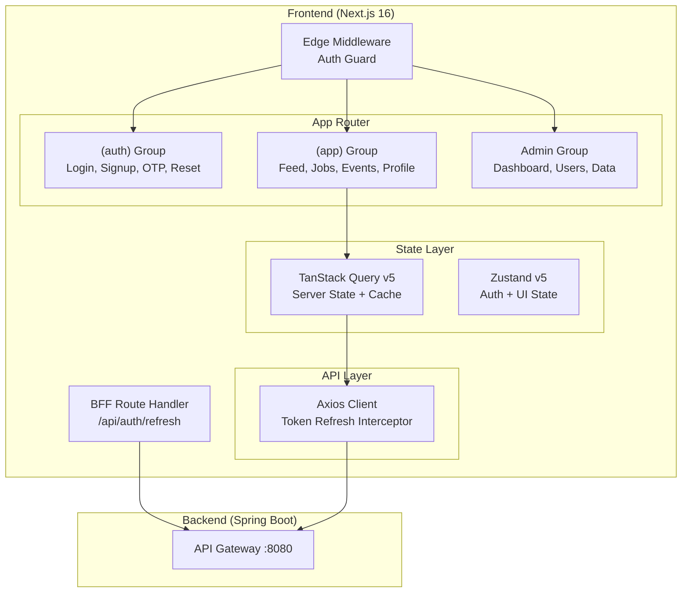

# GradNet Web App — Scaffolding Walkthrough

## Summary

Successfully scaffolded a production-grade **Next.js 16** (App Router) web application for the GradNet campus social and professional network. The app is fully wired to the existing Kotlin Spring Boot backend microservices and implements the **"Digital Curator"** design system from Stitch.

## Login Page Preview


## Build Status ✅

All **16 routes** compiled and generated successfully:

```
✓ Compiled successfully in 4.5s
✓ TypeScript passed in 1996ms
✓ 16/16 static pages generated in 215ms

Routes:
  ○ /           (landing)
  ○ /login      (auth)
  ○ /signup     (auth)
  ○ /verify-otp (auth)
  ○ /forgot-password (auth)
  ƒ /reset-password/[token] (dynamic)
  ○ /feed       (social feed)
  ○ /jobs       (job board)
  ○ /events     (campus events)
  ○ /lost-found (lost & found)
  ○ /profile    (user profile)
  ○ /settings   (account settings)
  ○ /admin      (admin dashboard)
  ƒ /api/auth/refresh (BFF route)
```

---

## Architecture



---

## File Structure (60+ files)

```
webApp/
├── src/
│   ├── app/
│   │   ├── layout.tsx                    # Root layout (fonts, providers, toaster)
│   │   ├── page.tsx                      # Landing page
│   │   ├── providers.tsx                 # React Query provider
│   │   ├── globals.css                   # Design tokens (Tailwind v4 @theme)
│   │   ├── api/auth/refresh/route.ts     # BFF refresh token handler
│   │   ├── (auth)/
│   │   │   ├── layout.tsx
│   │   │   ├── login/page.tsx
│   │   │   ├── signup/page.tsx
│   │   │   ├── verify-otp/page.tsx
│   │   │   ├── forgot-password/page.tsx
│   │   │   └── reset-password/[token]/page.tsx
│   │   └── (app)/
│   │       ├── layout.tsx                # Sidebar + TopBar + MobileNav shell
│   │       ├── feed/page.tsx             # Infinite scroll feed
│   │       ├── jobs/page.tsx             # Job board with filters
│   │       ├── events/page.tsx           # Events with category tabs
│   │       ├── lost-found/page.tsx       # Lost & found grid
│   │       ├── profile/page.tsx          # User profile page
│   │       ├── settings/page.tsx         # Account settings
│   │       └── admin/
│   │           ├── layout.tsx            # Admin sidebar layout
│   │           └── page.tsx              # Admin dashboard
│   ├── components/
│   │   ├── layout/
│   │   │   ├── Sidebar.tsx
│   │   │   ├── TopBar.tsx
│   │   │   ├── MobileNav.tsx
│   │   │   └── AdminSidebar.tsx
│   │   ├── shared/
│   │   │   ├── Avatar.tsx
│   │   │   ├── RoleBadge.tsx
│   │   │   ├── EmptyState.tsx
│   │   │   ├── LoadingSkeletons.tsx
│   │   │   ├── PermissionGate.tsx
│   │   │   ├── FeatureFlag.tsx
│   │   │   ├── ConfirmDialog.tsx
│   │   │   └── ImageUpload.tsx
│   │   ├── feed/
│   │   │   ├── PostCard.tsx
│   │   │   └── PostComposer.tsx
│   │   ├── jobs/
│   │   │   └── JobCard.tsx
│   │   └── events/
│   │       └── EventCard.tsx
│   ├── hooks/
│   │   ├── useAuth.ts
│   │   ├── usePosts.ts
│   │   ├── useJobs.ts
│   │   ├── useEvents.ts
│   │   ├── useLostFound.ts
│   │   ├── useProfile.ts
│   │   ├── useAdmin.ts
│   │   ├── useUpload.ts
│   │   └── usePagination.ts
│   ├── lib/
│   │   ├── api/
│   │   │   ├── client.ts                 # Axios + interceptors
│   │   │   ├── auth.ts, users.ts, posts.ts, jobs.ts,
│   │   │   │   events.ts, profile.ts, lostFound.ts,
│   │   │   │   storage.ts, admin.ts
│   │   │   └── index.ts
│   │   ├── schemas/
│   │   │   ├── auth.schema.ts
│   │   │   ├── post.schema.ts
│   │   │   ├── job.schema.ts
│   │   │   ├── event.schema.ts
│   │   │   └── profile.schema.ts
│   │   └── utils/
│   │       ├── cn.ts, formatters.ts, sanitize.ts
│   │       └── index.ts
│   ├── stores/
│   │   ├── authStore.ts                  # Token in memory (never localStorage)
│   │   └── uiStore.ts
│   ├── types/
│   │   ├── api.ts, auth.ts, post.ts, job.ts,
│   │   │   event.ts, profile.ts, admin.ts
│   │   └── index.ts
│   └── middleware.ts                     # Auth guard, admin guard, root redirect
├── .env.local
├── .env.example
├── package.json
└── tsconfig.json
```

---

## Key Design Decisions

| Decision | Rationale |
|---|---|
| **BFF Pattern** for auth | `refreshToken` stored in `httpOnly` cookie via Next.js Route Handler — never exposed to JS |
| **Zustand** for `accessToken` | Short-lived token kept in memory only, lost on page refresh (re-acquired via BFF) |
| **Optimistic updates** for likes | TanStack Query mutation with `onMutate` for instant UI feedback |
| **Tailwind v4 `@theme inline`** | CSS-first token system — all Stitch design tokens injected as CSS custom properties |
| **Edge Middleware** for auth | Cookie-based route protection at the edge, before any rendering |
| **Material Symbols** via CDN | Variable icon font for consistent icon system matching Stitch designs |

## Next Steps

- [ ] `Dockerfile` — Multi-stage build for containerized deployment
- [ ] CI/CD pipeline
- [ ] `shadcn/ui` component integration (requires Tailwind v4 compatible version)
- [ ] Tiptap rich text editor for post composition
- [ ] WebSocket integration for real-time notifications
